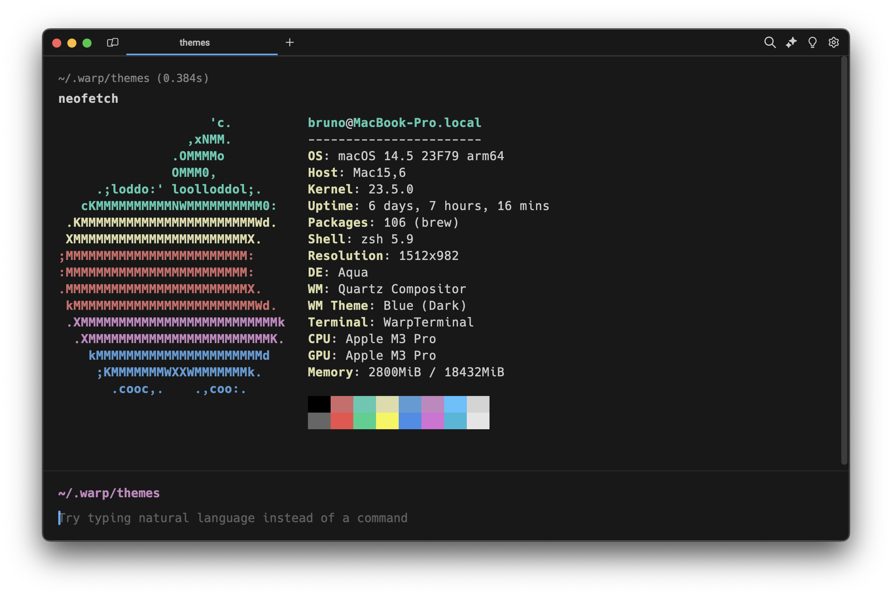

# Dark Modern for [Warp](https://warp.dev)

A custom theme for Warp based on Dark Modern.

## Install

- Create a config directory `~/.warp/themes` in your home directory.
- Download the .yaml theme [file](https://raw.githubusercontent.com/brunordgs/warp-dark-modern/main/Dark_Modern.yaml) from GitHub and copy it to `~/.warp/themes`.
- Change the theme in `Settings > Appearance` (`⌘+,`).

## License

[MIT License](./LICENSE)
